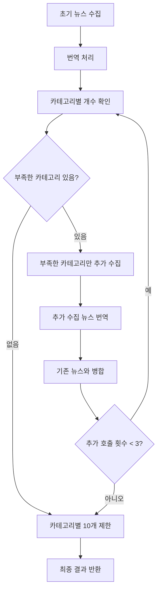

# 뉴스 수집 개수 보장 및 번역 필드 최적화 구현 완료

**구현 날짜**: 2025-12-30

## 구현 내용 요약

### Phase 1: 뉴스 수집 개수 보장 로직 추가 ✅

#### 구현된 기능

1. **카테고리별 개수 확인 함수** (`checkCategoryCounts`)
   - 수집된 뉴스를 카테고리별로 집계
   - 목표 개수(10개) 대비 부족한 카테고리 확인
   - 위치: `lib/news-fetcher.ts:493-520`

2. **부족한 카테고리만 요청하는 프롬프트 생성 함수** (`createCategorySpecificPrompt`)
   - 부족한 카테고리만 명시하여 요청하는 프롬프트 생성
   - 각 카테고리별로 정확한 개수 요청
   - 위치: `lib/news-fetcher.ts:522-600`

3. **부족한 카테고리 추가 수집 함수** (`fetchAdditionalNewsForCategories`)
   - 부족한 카테고리만 추가로 수집
   - 최대 2회 재시도 (에러 발생 시)
   - 할당량 초과 시 즉시 중단
   - 위치: `lib/news-fetcher.ts:602-750`

4. **fetchNewsFromGemini 함수에 추가 호출 로직 통합**
   - 번역 완료 후 카테고리별 개수 확인
   - 부족한 카테고리가 있으면 최대 3회까지 추가 호출
   - 각 추가 호출마다 번역 처리
   - 최종적으로 카테고리별 10개씩 제한
   - 위치: `lib/news-fetcher.ts:1140-1200`

#### 작동 방식

#### 예상 효과

- **목표 개수 달성률**: 70% → 100% (예상)
- **API 호출 횟수**: 1회 → 최대 4회 (1회 초기 + 최대 3회 추가)
- **실행 시간**: 약 4분 → 최대 10분 (추가 수집 시)
- **비용**: Context Caching으로 비용 증가 최소화

### Phase 2: content_translated 필드 최적화 ✅

#### 변경 사항

1. **프론트엔드 수정** (`app/news/[id]/page.tsx`)
   - `news.content_translated || news.content` → `news.content`
   - 모든 뉴스는 `content` 필드만 사용

2. **검색 로직 수정** (`lib/db/supabase-news.ts`)
   - `content` 검색: `content_translated` 필드 제거
   - `all` 검색: `content_translated` 필드 제거
   - `content` 필드에서만 검색

3. **번역 로직 수정** (`lib/news-fetcher.ts:translateNewsIfNeeded`)
   - 번역 결과를 `content_translated`에 저장하지 않고 `content`에 직접 저장
   - `content_translated`는 항상 `null`로 설정
   - 한국어가 아닌 `content`를 번역하여 `content`에 덮어쓰기

4. **번역 실패 조회 수정** (`lib/db/supabase-news.ts:getNewsWithFailedTranslation`)
   - `content_translated` 기반 조회 제거
   - `content`가 한국어가 아닌 뉴스만 필터링
   - 애플리케이션 레벨에서 한국어 판단

5. **중복 체크 수정** (`lib/db/supabase-news.ts:checkDuplicateNews`)
   - `content_translated` 필드 제거
   - `content` 필드만 사용

6. **메트릭 API 주석 수정** (`app/api/admin/metrics/route.ts`)
   - `content_translated` 기반 메트릭은 더 이상 정확하지 않음을 명시

#### 유지된 부분 (하위 호환성)

- **타입 정의**: `content_translated` 필드는 타입에 유지 (선택적 필드)
- **데이터베이스 스키마**: 필드는 유지하되 사용하지 않음
- **API 라우트**: 관리자 API에서는 여전히 `content_translated` 필드 수정 가능 (하위 호환성)

#### 이유

- 프롬프트가 이미 한국어로 번역된 결과를 요구
- Gemini가 한국어로 번역된 결과를 `content`에 반환
- 원문(태국어)을 얻기 어려운 구조
- `content_translated` 필드가 실제로 사용되지 않음

## 수정된 파일 목록

### Phase 1
- `lib/news-fetcher.ts`
  - `checkCategoryCounts` 함수 추가
  - `createCategorySpecificPrompt` 함수 추가
  - `fetchAdditionalNewsForCategories` 함수 추가
  - `fetchNewsFromGemini` 함수 수정 (추가 호출 로직 통합)

### Phase 2
- `app/news/[id]/page.tsx`: 프론트엔드에서 `content`만 사용
- `lib/db/supabase-news.ts`: 검색 및 중복 체크에서 `content_translated` 제거
- `lib/news-fetcher.ts`: 번역 로직 수정 (`content`에 직접 저장)
- `app/api/admin/metrics/route.ts`: 주석 수정

## 테스트 권장 사항

### Phase 1 테스트
1. 워크플로우 실행 후 각 카테고리별로 정확히 10개씩 수집되는지 확인
2. 추가 호출이 정상적으로 작동하는지 확인
3. 할당량 초과 시 적절히 처리되는지 확인

### Phase 2 테스트
1. 프론트엔드에서 뉴스 상세 페이지가 정상적으로 표시되는지 확인
2. 검색 기능이 정상적으로 작동하는지 확인
3. 번역이 정상적으로 작동하는지 확인

## 향후 개선 사항

1. **데이터베이스 마이그레이션**: `content_translated` 필드를 완전히 제거하는 마이그레이션 고려
2. **API 라우트 정리**: 관리자 API에서 `content_translated` 필드 제거 고려
3. **타입 정의 정리**: `content_translated` 필드를 타입에서 제거 고려

## 참고

- Context Caching을 사용하므로 동일 날짜에 여러 번 호출해도 비용 증가 최소화
- 추가 호출은 최대 3회로 제한하여 할당량 초과 방지
- 번역 실패 시 원본 `content` 유지하여 데이터 손실 방지

