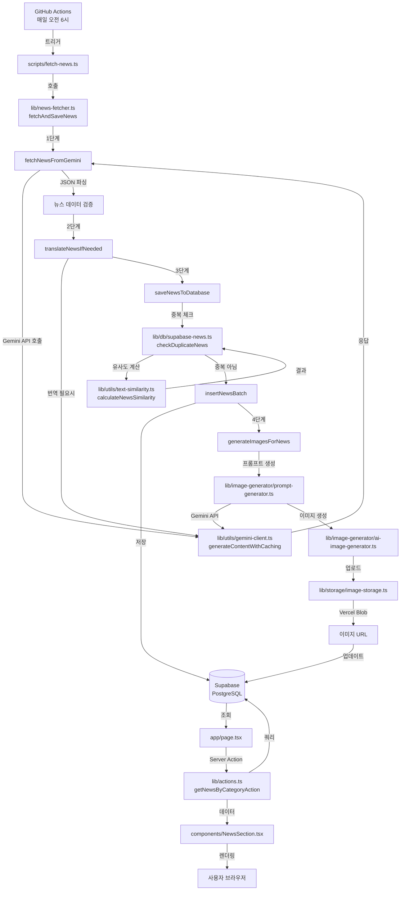
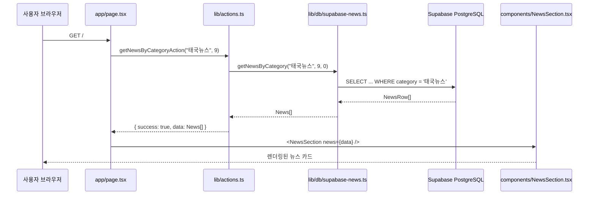

# Daily News 프로젝트 로직 상세 분석 문서

## 1. 소프트웨어 생애주기 (SDLC)

### 1.1 요구사항 분석 및 설계

- **목표**: Google Gemini API를 활용한 태국/한국 뉴스 자동 수집 및 표시 시스템
- **주요 요구사항**:
  - 매일 자동 뉴스 수집 (GitHub Actions)
  - 태국 뉴스 한국어 번역
  - AI 이미지 자동 생성
  - 카테고리별 분류 및 표시
  - 중복 뉴스 방지

### 1.2 개발 단계

1. **초기 설정**: Next.js 14 App Router, Supabase, TypeScript
2. **핵심 기능 구현**: 뉴스 수집, 번역, 이미지 생성
3. **관리자 페이지**: 뉴스 관리, 모니터링
4. **웹 분석**: 사용자 행동 추적
5. **최적화**: 성능, 보안, 에러 핸들링

### 1.3 배포 및 운영

- **배포**: Vercel (자동 배포)
- **CI/CD**: GitHub Actions
- **모니터링**: Sentry
- **데이터베이스**: Supabase (PostgreSQL)

## 2. 전체 시스템 아키텍처

### 2.1 데이터 흐름 다이어그램

### 2.2 사용자 요청 흐름

## 3. 핵심 기능별 상세 로직

### 3.1 뉴스 수집 프로세스

#### 3.1.1 진입점: `scripts/fetch-news.ts`

- **역할**: GitHub Actions에서 실행되는 엔트리 포인트
- **주요 로직**:
  1. 환경 변수 검증 (`GOOGLE_GEMINI_API_KEY`, `NEXT_PUBLIC_SUPABASE_URL` 등)
  2. `fetchAndSaveNews()` 호출
  3. 결과 로깅 및 exit code 설정

#### 3.1.2 메인 함수: `lib/news-fetcher.ts::fetchAndSaveNews()`

- **시그니처**: `fetchAndSaveNews(date?, maxImageGenerationTimeMs?, limit?, categoryFilter?)`
- **프로세스**:
  1. `fetchNewsFromGemini()` 호출 → 뉴스 수집
  2. `saveNewsToDatabase()` 호출 → DB 저장 및 이미지 생성
  3. 메트릭 저장 (`saveMetricSnapshot`)

#### 3.1.3 뉴스 수집: `lib/news-fetcher.ts::fetchNewsFromGemini()`

- **프로세스**:
  1. **날짜 검증**: 미래 날짜 방지
  2. **모델 선택**: `getModelForTask("news_collection", date)` → `lib/utils/gemini-client.ts`
  3. **프롬프트 생성**: 카테고리 필터와 limit에 따라 동적 생성
  4. **API 호출**: `generateContentWithCaching()` → Context Caching 지원
  5. **JSON 추출**: `extractJSON()` → 마크다운 코드 블록에서 JSON 추출
  6. **데이터 검증**: 필수 필드(title, content, category 등) 확인
  7. **번역 처리**: `translateNewsIfNeeded()` → 한국어가 아닌 뉴스 번역
  8. **카테고리 필터링**: `categoryFilter`가 있으면 필터링
  9. **개수 제한**: `limit`이 있으면 slice

#### 3.1.4 번역 로직: `lib/news-fetcher.ts::translateNewsIfNeeded()`

- **프로세스**:
  1. **한국어 판단**: `isKorean()` → 한글 문자 비율 30% 이상
  2. **제목 번역**: 한국어가 아니면 `translateToKorean()` 호출
  3. **내용 번역**: 한국어가 아니면 `translateToKorean()` 호출
  4. **재시도 로직**: 번역 결과가 원본과 같으면 최대 3회 재시도 (지수 백오프)
  5. **실패 처리**: 재시도 후에도 실패하면 `translationFailed: true` 반환

#### 3.1.5 Gemini API 클라이언트: `lib/utils/gemini-client.ts`

- **주요 함수**:
  - `getModelForTask(taskType, cacheKeySource)`: 작업 유형에 따른 모델 선택
    - `news_collection`: `gemini-2.5-pro` (환경 변수로 제어)
    - `translation`: `gemini-2.5-flash` (환경 변수로 제어)
    - `prompt_generation`: `gemini-2.5-flash`
  - `generateContentWithCaching()`: Context Caching 지원 API 호출
    - 캐시 키 생성: 날짜/텍스트 해시 기반
    - 사용량 추적: `trackGeminiUsage()` 호출
    - 에러 처리: 폴백 로직 포함

### 3.2 데이터베이스 저장 프로세스

#### 3.2.1 저장 함수: `lib/news-fetcher.ts::saveNewsToDatabase()`

- **프로세스**:
  1. `insertNewsBatch()` 호출 → 배치 저장 (최대 10개씩 병렬)
  2. 저장 성공 시 `generateImagesForNews()` 호출 → 이미지 생성
  3. 비동기로 `retryFailedTranslations()` 호출 → 번역 실패 뉴스 재처리

#### 3.2.2 중복 체크: `lib/db/supabase-news.ts::checkDuplicateNews()`

- **프로세스**:
  1. `checkDuplicateNewsBySimilarity()` 호출
  2. 최근 7일간 뉴스 조회
  3. 각 기존 뉴스와 유사도 계산: `calculateNewsSimilarity()`
  4. 유사도 85% 이상이면 중복으로 판단

#### 3.2.3 유사도 계산: `lib/utils/text-similarity.ts`

- **알고리즘**:
  - `calculateJaccardSimilarity()`: 단어 집합 기반 Jaccard 유사도
  - `calculateNewsSimilarity()`: 제목 50% + 내용 50% 가중 평균
  - 제목 유사도 90% 이상이면 추가 가중치 적용

#### 3.2.4 배치 저장: `lib/db/supabase-news.ts::insertNewsBatch()`

- **프로세스**:
  1. 뉴스 항목을 10개씩 배치로 분할
  2. 각 배치를 `Promise.allSettled()`로 병렬 처리
  3. 각 뉴스에 대해 `insertNews()` 호출
  4. 결과 집계 (success/failed count)

### 3.3 이미지 생성 프로세스

#### 3.3.1 이미지 생성 함수: `lib/news-fetcher.ts::generateImagesForNews()`

- **프로세스**:
  1. `IMAGE_GENERATION_API` 환경 변수 확인 → 'none'이면 스킵
  2. 저장된 뉴스 ID를 5개씩 배치로 처리
  3. 타임아웃 체크: `maxImageGenerationTimeMs` 설정 시
  4. 각 뉴스에 대해:
     - `generateImagePrompt()` → 이미지 프롬프트 생성
     - `generateAIImage()` → AI 이미지 생성
     - `uploadNewsImage()` → Vercel Blob에 업로드
     - `updateNewsImageUrl()` → DB에 image_url 업데이트

#### 3.3.2 프롬프트 생성: `lib/image-generator/prompt-generator.ts::generateImagePrompt()`

- **프로세스**:
  1. 캐시 키 생성: `제목_내용(100자)`
  2. 카테고리별 스타일 가이드 선택
  3. Gemini API 호출: 뉴스 내용 기반 영어 프롬프트 생성
  4. 요구사항: 2D 애니메이션 스타일, 텍스트 없음, 80-150 단어

#### 3.3.3 이미지 생성: `lib/image-generator/ai-image-generator.ts::generateAIImage()`

- **프로세스**:
  1. Gemini REST API 직접 호출: `gemini-2.5-flash-image` 모델
  2. 응답에서 base64 이미지 데이터 추출
  3. Buffer로 변환하여 반환

#### 3.3.4 이미지 업로드: `lib/storage/image-storage.ts::uploadNewsImage()`

- **프로세스**:
  1. Vercel Blob Storage에 업로드: `news/{newsId}.png`
  2. Public URL 반환

### 3.4 뉴스 조회 프로세스

#### 3.4.1 페이지 컴포넌트: `app/page.tsx`

- **프로세스**:
  1. `Promise.all()`로 3개 카테고리 동시 조회
  2. `getNewsByCategoryAction()` 호출
  3. 에러 처리 및 로깅
  4. `NewsSection` 컴포넌트에 데이터 전달

#### 3.4.2 Server Action: `lib/actions.ts::getNewsByCategoryAction()`

- **프로세스**:
  1. `newsDB.getNewsByCategory()` 호출
  2. 데이터 검증: `validateNewsData()`
  3. 에러 처리: `handleActionError()`

#### 3.4.3 데이터베이스 쿼리: `lib/db/supabase-news.ts::getNewsByCategory()`

- **프로세스**:
  1. Supabase 쿼리: `category` 필터, `published_date DESC, created_at DESC` 정렬
  2. 페이지네이션: `.range(offset, offset + limit - 1)`
  3. 데이터 변환: `NewsRow` → `News`

### 3.5 보안 및 인증

#### 3.5.1 Middleware: `middleware.ts`

- **프로세스**:
  1. **CSRF 보호**: POST/PUT/PATCH/DELETE 요청에 대해 CSRF 토큰 검증
     - 제외 라우트: `/api/csrf-token`, `/api/manual/fetch-news`, `/api/cron/fetch-news`, `/api/analytics`
  2. **관리자 인증**: `/admin` 경로 접근 시 `isAdminAuthenticated()` 확인
  3. **리다이렉션**: 미인증 시 `/admin/login`으로 리다이렉션

#### 3.5.2 CSRF 토큰: `lib/utils/csrf.ts`

- **프로세스**:
  1. **생성**: `generateCsrfToken()` → Web Crypto API 또는 Node.js crypto
  2. **설정**: `setCsrfToken()` → 쿠키에 저장
  3. **검증**: `verifyCsrfToken()` → 타이밍 공격 방지 비교

#### 3.5.3 관리자 인증: `lib/utils/admin-auth.ts`

- **프로세스**:
  1. **비밀번호 검증**: `verifyAdminPassword()` → 환경 변수와 비교
  2. **세션 관리**: 쿠키 기반 세션 토큰
  3. **인증 확인**: `isAdminAuthenticated()` → 쿠키 존재 여부 확인

### 3.6 사용량 추적

#### 3.6.1 사용량 추적: `lib/utils/gemini-usage-tracker.ts::trackGeminiUsage()`

- **프로세스**:
  1. API 호출 결과에서 토큰 사용량 추출: `extractTokenUsage()`
  2. 비용 추정: `estimateCost()` → 모델별 토큰 가격 적용
  3. 로그 저장: `saveGeminiUsageLog()` → `gemini_usage_logs` 테이블

## 4. 파일별 역할 상세

### 4.1 뉴스 수집 관련

- **`lib/news-fetcher.ts`**: 뉴스 수집, 번역, 저장의 핵심 로직
- **`lib/utils/gemini-client.ts`**: Gemini API 클라이언트, 모델 선택, Context Caching
- **`scripts/fetch-news.ts`**: GitHub Actions 실행 스크립트

### 4.2 데이터베이스 관련

- **`lib/db/supabase-news.ts`**: Supabase 쿼리, 중복 체크, CRUD 작업
- **`lib/utils/text-similarity.ts`**: 텍스트 유사도 계산 알고리즘

### 4.3 이미지 관련

- **`lib/image-generator/prompt-generator.ts`**: 이미지 프롬프트 생성
- **`lib/image-generator/ai-image-generator.ts`**: AI 이미지 생성
- **`lib/storage/image-storage.ts`**: Vercel Blob Storage 업로드/삭제

### 4.4 UI 관련

- **`app/page.tsx`**: 메인 페이지 (Server Component)
- **`components/NewsSection.tsx`**: 뉴스 섹션 컴포넌트
- **`components/NewsCard.tsx`**: 개별 뉴스 카드 컴포넌트

### 4.5 API 관련

- **`lib/actions.ts`**: Server Actions (뉴스 조회, 수집)
- **`middleware.ts`**: 요청 미들웨어 (CSRF, 인증)

### 4.6 보안 관련

- **`lib/utils/csrf.ts`**: CSRF 토큰 생성/검증
- **`lib/utils/admin-auth.ts`**: 관리자 인증

### 4.7 모니터링 관련

- **`lib/utils/gemini-usage-tracker.ts`**: Gemini API 사용량 추적
- **`lib/utils/logger.ts`**: 구조화된 로깅 (Pino)

## 5. 주요 알고리즘 및 패턴

### 5.1 중복 뉴스 감지 알고리즘

- **Jaccard 유사도**: 단어 집합 기반
- **가중 평균**: 제목 50% + 내용 50%
- **임계값**: 85% 이상이면 중복

### 5.2 재시도 패턴

- **지수 백오프**: 1초, 2초, 4초
- **최대 재시도**: 3회
- **할당량 초과**: 재시도하지 않고 즉시 실패

### 5.3 배치 처리 패턴

- **뉴스 저장**: 10개씩 배치
- **번역**: 5개씩 배치
- **이미지 생성**: 5개씩 배치

### 5.4 캐싱 전략

- **Context Caching**: Gemini API의 Context Caching 활용
- **페이지 캐싱**: Next.js `revalidate = 60` (60초)

## 6. 에러 핸들링

### 6.1 계층적 에러 처리

1. **API 레벨**: `lib/news-fetcher.ts`에서 Gemini API 에러 처리
2. **데이터베이스 레벨**: `lib/db/supabase-news.ts`에서 Supabase 에러 처리
3. **액션 레벨**: `lib/actions.ts`에서 `handleActionError()` 통합 처리
4. **UI 레벨**: `app/page.tsx`에서 에러 메시지 표시

### 6.2 주요 에러 타입

- **할당량 초과**: 재시도하지 않고 원본 반환
- **네트워크 에러**: 지수 백오프로 재시도
- **JSON 파싱 에러**: `extractJSON()`로 복구 시도
- **중복 뉴스**: 정상 처리 (건너뜀)

## 7. 성능 최적화

### 7.1 병렬 처리

- 뉴스 번역: 5개씩 병렬
- 이미지 생성: 5개씩 병렬
- 뉴스 저장: 10개씩 병렬

### 7.2 캐싱

- Context Caching: Gemini API 호출 최적화
- 페이지 캐싱: Next.js ISR (60초)

### 7.3 데이터베이스 최적화

- 인덱스: `published_date`, `category`, `created_at`
- 페이지네이션: `.range()` 사용
- 필요한 필드만 선택: `.select()` 최적화

## 8. 배포 및 CI/CD

### 8.1 GitHub Actions 워크플로우

- **트리거**: 매일 UTC 23시 (태국 시간 오전 6시)
- **단계**:
  1. 코드 체크아웃
  2. Node.js 설정
  3. 의존성 설치
  4. 환경 변수 검증
  5. 뉴스 수집 실행
  6. 실패 시 로그 업로드

### 8.2 Vercel 배포

- **자동 배포**: GitHub 푸시 시 자동 배포
- **환경 변수**: Vercel 대시보드에서 관리
- **Edge Network**: 글로벌 CDN

## 9. 모니터링 및 로깅

### 9.1 Sentry 통합

- **에러 추적**: 자동 에러 캡처
- **성능 모니터링**: 응답 시간 추적
- **릴리스 추적**: 배포 버전 추적

### 9.2 구조화된 로깅

- **Pino**: 고성능 로거
- **로그 레벨**: debug, info, warn, error
- **메타데이터**: 컨텍스트 정보 포함

### 9.3 사용량 추적

- **Gemini API**: 토큰 사용량, 비용 추정
- **메트릭 저장**: `saveMetricSnapshot()` → 비즈니스 메트릭

## 10. 데이터베이스 스키마

### 10.1 주요 테이블

- **`news`**: 뉴스 데이터 (id, title, content, category, published_date 등)
- **`gemini_usage_logs`**: Gemini API 사용량 로그
- **`page_views`**: 페이지뷰 추적
- **`events`**: 사용자 이벤트 추적
- **`sessions`**: 세션 관리

### 10.2 인덱스

- `idx_news_category_published`: category, published_date
- `idx_news_created_at`: created_at
- `idx_gemini_usage_timestamp`: timestamp

## 11. 보안 고려사항

### 11.1 CSRF 보호

- POST/PUT/PATCH/DELETE 요청에 CSRF 토큰 필수
- 타이밍 공격 방지 비교

### 11.2 관리자 인증

- 비밀번호 기반 인증
- 세션 쿠키 (7일 유지)
- httpOnly, secure 플래그

### 11.3 입력 검증

- Zod를 사용한 런타임 타입 검증
- XSS 방지 (HTML 이스케이프)
- SQL Injection 방지 (Supabase 자동 처리)

## 12. 확장성 고려사항

### 12.1 현재 제한사항

- Vercel Serverless Functions 타임아웃 (300초)
- 메모리 기반 Rate Limiting

### 12.2 향후 개선 방향

- Redis를 통한 Rate Limiting
- 데이터베이스 연결 풀 최적화
- CDN 캐싱 전략 개선

---

**작성일**: 2025-01-01
**버전**: 1.0.0
**작성자**: AI Agent

이 문서는 Daily News 프로젝트의 전체 로직과 작동 원리를 상세히 설명합니다. 각 파일과 함수의 역할, 데이터 흐름, 알고리즘, 보안, 성능 최적화 등을 포함합니다.

