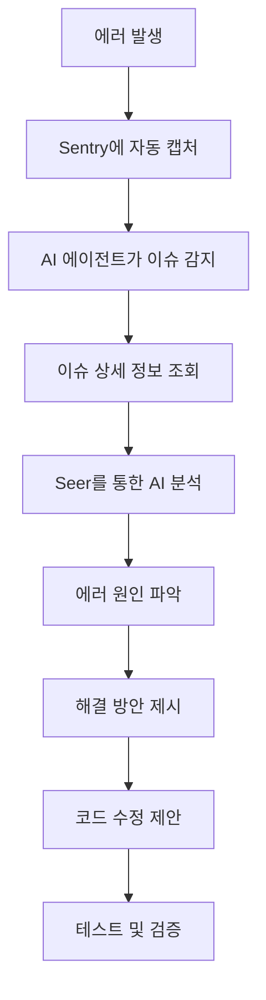

# Sentry AI 에이전트 통합 설정 가이드

## 개요

이 문서는 AI 에이전트(Cursor AI)가 Sentry를 통해 개발 과정에서 발생하는 오류를 추적, 분석, 해결하는데 필요한 설정과 사용 방법을 설명합니다.

## 현재 설정 상태

### ✅ 이미 완료된 설정

1. **Sentry SDK 설정**

   - 클라이언트 사이드: `sentry.client.config.ts`
   - 서버 사이드: `sentry.server.config.ts`
   - Edge Runtime: `sentry.edge.config.ts`

2. **Sentry MCP 서버 연결**

   - 조직: `personal-4vx`
   - 프로젝트: `daily-news`
   - Region: `us.sentry.io`
   - Web URL: `https://personal-4vx.sentry.io`

3. **에러 캡처 통합**

   - `ErrorBoundary`에서 React 에러 캡처
   - API 미들웨어에서 서버 에러 캡처
   - 구조화된 에러 처리 (`AppError`)

4. **환경 변수 설정**
   - `NEXT_PUBLIC_SENTRY_DSN`: Sentry DSN
   - `SENTRY_ORG`: Sentry 조직
   - `SENTRY_PROJECT`: Sentry 프로젝트

## AI 에이전트가 사용할 수 있는 기능

### 1. Sentry MCP 서버 도구

#### 이슈 검색 및 조회

```typescript
// 최근 발생한 에러 이슈 검색
"최근 발생한 에러 이슈를 검색해줘";

// 특정 에러 타입 검색
"TypeError 관련 이슈를 찾아줘";

// 해결되지 않은 이슈 조회
"해결되지 않은 에러 이슈 목록을 보여줘";
```

**사용 가능한 MCP 도구**:

- `mcp_Sentry_search_issues`: 이슈 검색
- `mcp_Sentry_get_issue_details`: 이슈 상세 정보 조회
- `mcp_Sentry_search_issue_events`: 이슈 내 이벤트 검색

#### 이슈 관리

```typescript
// 이슈 해결
"이슈 PROJECT-123을 해결 상태로 변경해줘";

// 이슈 할당
"이슈 PROJECT-123을 나에게 할당해줘";

// 이슈 무시
"이슈 PROJECT-123을 무시 상태로 변경해줘";
```

**사용 가능한 MCP 도구**:

- `mcp_Sentry_update_issue`: 이슈 상태 변경

#### 이벤트 검색 및 분석

```typescript
// 최근 에러 이벤트 검색
"최근 1시간 동안 발생한 에러 이벤트를 보여줘";

// 특정 에러 카운트
"오늘 발생한 TypeError 개수를 알려줘";

// 에러 트렌드 분석
"최근 7일간 에러 발생 트렌드를 분석해줘";
```

**사용 가능한 MCP 도구**:

- `mcp_Sentry_search_events`: 이벤트 검색 및 통계
- `mcp_Sentry_get_trace_details`: 트레이스 상세 정보

#### AI 기반 에러 분석 (Seer)

```typescript
// 에러 원인 분석
"이슈 PROJECT-123의 원인을 분석해줘";

// 코드 수정 제안
"이 에러를 해결하기 위한 코드 수정을 제안해줘";
```

**사용 가능한 MCP 도구**:

- `mcp_Sentry_analyze_issue_with_seer`: AI 기반 에러 분석

### 2. 프로젝트 내 Sentry 통합 API

#### 분석 API

**엔드포인트**: `GET /api/admin/sentry/analysis`

```typescript
// 최근 7일간 에러 분석
fetch("/api/admin/sentry/analysis?days=7");

// 해결되지 않은 에러만 조회
fetch("/api/admin/sentry/analysis?status=unresolved&limit=20");

// 특정 쿼리로 검색
fetch("/api/admin/sentry/analysis?query=TypeError&days=3");
```

**응답 형식**:

```json
{
  "success": true,
  "data": {
    "summary": {
      "totalIssues": 10,
      "unresolvedIssues": 5,
      "resolvedIssues": 3,
      "ignoredIssues": 2,
      "period": "7일"
    },
    "issues": [...],
    "projectUrl": "https://personal-4vx.sentry.io/projects/daily-news/",
    "recommendations": [...]
  }
}
```

#### 이슈 상세 분석 API

**엔드포인트**: `POST /api/admin/sentry/analysis`

```typescript
// 특정 이슈 상세 분석
fetch("/api/admin/sentry/analysis", {
  method: "POST",
  body: JSON.stringify({
    issueId: "PROJECT-123",
    // 또는
    issueUrl: "https://personal-4vx.sentry.io/issues/PROJECT-123/",
  }),
});
```

### 3. CLI 스크립트

#### 에러 분석

```bash
# 최근 7일간 에러 분석
npm run sentry:analyze analyze 7

# 최근 30일간 에러 분석
npm run sentry:analyze analyze 30
```

#### 이슈 검색

```bash
# 자연어 쿼리로 이슈 검색
npm run sentry:analyze issues "최근 발생한 TypeError"

# 해결되지 않은 에러 검색
npm run sentry:analyze issues "unresolved errors"
```

#### 통계 조회

```bash
# 최근 7일간 에러 통계
npm run sentry:analyze stats 7
```

## 실제 사용 시나리오

### 시나리오 1: 개발 중 에러 발생 시 자동 분석

**상황**: 개발 중 에러가 발생했을 때

**AI 에이전트에게 요청**:

```
"방금 발생한 에러를 Sentry에서 찾아서 원인을 분석해줘"
```

**AI 에이전트 프로세스**:

1. Sentry MCP 서버를 통해 최근 이슈 검색
2. 가장 최근 이슈의 상세 정보 조회
3. Seer를 통한 AI 분석 실행
4. 에러 원인 및 해결 방안 제시
5. 필요시 코드 수정 제안

### 시나리오 2: 배포 후 에러 모니터링

**상황**: 배포 후 프로덕션에서 에러 발생

**AI 에이전트에게 요청**:

```
"최근 배포 후 발생한 새로운 에러를 찾아서 분석해줘"
```

**AI 에이전트 프로세스**:

1. 최근 N일간 이슈 검색
2. 배포 시간 이후 발생한 이슈 필터링
3. 각 이슈의 상세 정보 및 트렌드 분석
4. 우선순위별로 정리하여 보고
5. 중요 에러는 GitHub 이슈 자동 생성 제안

### 시나리오 3: 에러 패턴 분석

**상황**: 반복되는 에러 패턴 파악

**AI 에이전트에게 요청**:

```
"최근 일주일간 반복되는 에러 패턴을 분석해줘"
```

**AI 에이전트 프로세스**:

1. 최근 7일간 모든 이슈 조회
2. 에러 타입별 그룹화
3. 발생 빈도 및 트렌드 분석
4. 공통 원인 식별
5. 해결 우선순위 제시

### 시나리오 4: 특정 에러 해결

**상황**: 특정 에러를 해결하고 싶을 때

**AI 에이전트에게 요청**:

```
"이슈 PROJECT-123을 분석하고 해결 방법을 제시해줘"
```

**AI 에이전트 프로세스**:

1. 이슈 상세 정보 조회
2. Seer를 통한 AI 분석 실행
3. 에러가 발생한 코드 위치 식별
4. 관련 코드 파일 읽기
5. 수정 제안 코드 생성
6. 테스트 방법 제안

## Sentry 헬퍼 유틸리티 사용법

### 코드에서 직접 사용

```typescript
import { captureErrorWithContext, addSentryBreadcrumb, setSentryTag } from "@/lib/utils/sentry-helper";

// 컨텍스트와 함께 에러 캡처
try {
  // 코드 실행
} catch (error) {
  captureErrorWithContext(error, {
    tags: {
      feature: "news-fetch",
      step: "image-generation",
    },
    extra: {
      newsId: "123",
      retryCount: 3,
    },
    level: "error",
  });
}

// 디버깅을 위한 브레드크럼 추가
addSentryBreadcrumb("이미지 생성 시작", "image-generation", "info", {
  newsId: "123",
  prompt: "...",
});

// 태그 설정
setSentryTag("feature", "analytics");
```

## 환경 변수 설정

### 필수 환경 변수

`.env.local` 파일에 다음 변수들이 설정되어 있어야 합니다:

```env
# Sentry DSN (클라이언트/서버 공통)
NEXT_PUBLIC_SENTRY_DSN=https://xxx@xxx.ingest.sentry.io/xxx

# Sentry 조직 및 프로젝트 (소스맵 업로드용)
SENTRY_ORG=personal-4vx
SENTRY_PROJECT=daily-news

# Sentry 릴리스 (선택적)
NEXT_PUBLIC_SENTRY_RELEASE=1.0.0
```

### 선택적 환경 변수

```env
# Sentry Region (기본값: us)
SENTRY_REGION=us

# Sentry API 토큰 (MCP 서버용, 선택적)
SENTRY_AUTH_TOKEN=xxx
```

## Sentry MCP 서버 설정 확인

### 현재 설정

MCP 서버는 `c:\Users\Dohyeongheo\.cursor\mcp.json`에 설정되어 있습니다:

```json
{
  "mcpServers": {
    "Sentry": {
      "url": "https://mcp.sentry.dev/mcp",
      "headers": {}
    }
  }
}
```

### 연결 확인

AI 에이전트에게 다음 명령어로 연결을 확인할 수 있습니다:

```
"Sentry MCP 서버 연결 상태를 확인해줘"
```

또는 직접 확인:

```
"Sentry 조직 목록을 보여줘"
```

## 에러 추적 워크플로우

### 자동 에러 캡처

1. **클라이언트 사이드 에러**

   - `ErrorBoundary`에서 자동 캡처
   - React 컴포넌트 트리에서 발생한 에러

2. **서버 사이드 에러**

   - API 미들웨어(`withErrorHandling`)에서 자동 캡처
   - 모든 API 라우트에서 발생한 에러

3. **수동 에러 캡처**
   - `captureErrorWithContext()` 함수 사용
   - 특정 컨텍스트와 함께 에러 전송

### 에러 분석 프로세스



## AI 에이전트 활용 팁

### 1. 자연어 쿼리 활용

Sentry MCP 서버는 자연어 쿼리를 지원합니다:

```
✅ 좋은 예:
"최근 발생한 TypeError를 찾아줘"
"해결되지 않은 에러 중 가장 많이 발생한 것을 보여줘"
"Analytics 관련 에러를 검색해줘"

❌ 나쁜 예:
"에러 찾기"
"문제"
```

### 2. 구체적인 요청

더 구체적인 요청을 하면 더 정확한 결과를 얻을 수 있습니다:

```
✅ 좋은 예:
"최근 3일간 발생한 API 에러를 분석하고 해결 방법을 제시해줘"
"이슈 PROJECT-123의 원인을 분석하고 코드를 수정해줘"

❌ 나쁜 예:
"에러 확인"
"문제 해결"
```

### 3. 단계별 요청

복잡한 작업은 단계별로 나누어 요청:

```
1단계: "최근 발생한 에러 목록을 보여줘"
2단계: "이슈 PROJECT-123의 상세 정보를 보여줘"
3단계: "이 에러의 원인을 분석해줘"
4단계: "해결 방법을 제시하고 코드를 수정해줘"
```

## 문제 해결

### Sentry MCP 서버 연결 실패

**증상**: "Sentry 조직 목록을 보여줘" 요청이 실패

**해결 방법**:

1. `mcp.json` 파일에서 Sentry 설정 확인
2. Cursor 재시작
3. MCP 서버 로그 확인

### 에러가 Sentry에 전송되지 않음

**증상**: 에러가 발생했지만 Sentry에 표시되지 않음

**해결 방법**:

1. `NEXT_PUBLIC_SENTRY_DSN` 환경 변수 확인
2. 브라우저 콘솔에서 Sentry 초기화 로그 확인
3. `isSentryEnabled()` 함수로 설정 확인

### AI 에이전트가 이슈를 찾지 못함

**증상**: "최근 에러를 찾아줘" 요청이 결과를 반환하지 않음

**해결 방법**:

1. Sentry 프로젝트에 실제 이슈가 있는지 확인
2. 더 구체적인 검색 쿼리 사용
3. 날짜 범위 조정

## 참고 자료

- [Sentry 공식 문서](https://docs.sentry.io/)
- [Sentry MCP 서버 문서](https://github.com/modelcontextprotocol/servers)
- [MCP 서버 테스트 결과](./MCP_SERVERS_TEST_RESULTS.md)
- [AI 에이전트 에러 트래킹 분석](./AI_AGENT_ERROR_TRACKING_ANALYSIS.md)
- [Sentry 테스트 결과](./SENTRY_TEST_RESULTS.md)

## 다음 단계

1. ✅ Sentry SDK 설정 완료
2. ✅ API 미들웨어 통합 완료
3. ✅ Sentry 헬퍼 유틸리티 생성 완료
4. ✅ 분석 API 생성 완료
5. ✅ CLI 스크립트 생성 완료
6. ⏳ 실제 사용 시나리오 테스트
7. ⏳ 에러 패턴 학습 및 개선

## 자주 묻는 질문 (FAQ)

### Q: 개발 환경에서도 Sentry에 에러가 전송되나요?

A: 네, 개발 환경에서도 전송됩니다. 다만 `beforeSend`에서 개발 환경 로깅이 강화되어 있어 콘솔에도 출력됩니다.

### Q: 민감한 정보는 어떻게 보호하나요?

A: API 미들웨어에서 `authorization`, `cookie`, `x-api-key` 등 민감한 헤더는 자동으로 제외됩니다.

### Q: AI 에이전트가 자동으로 에러를 해결하나요?

A: AI 에이전트는 에러를 분석하고 해결 방안을 제시하지만, 실제 코드 수정은 사용자의 승인이 필요합니다.

### Q: Sentry MCP 서버 없이도 사용할 수 있나요?

A: 네, 프로젝트 내 API와 CLI 스크립트는 MCP 서버 없이도 사용 가능합니다. 다만 MCP 서버를 사용하면 더 강력한 기능을 활용할 수 있습니다.
